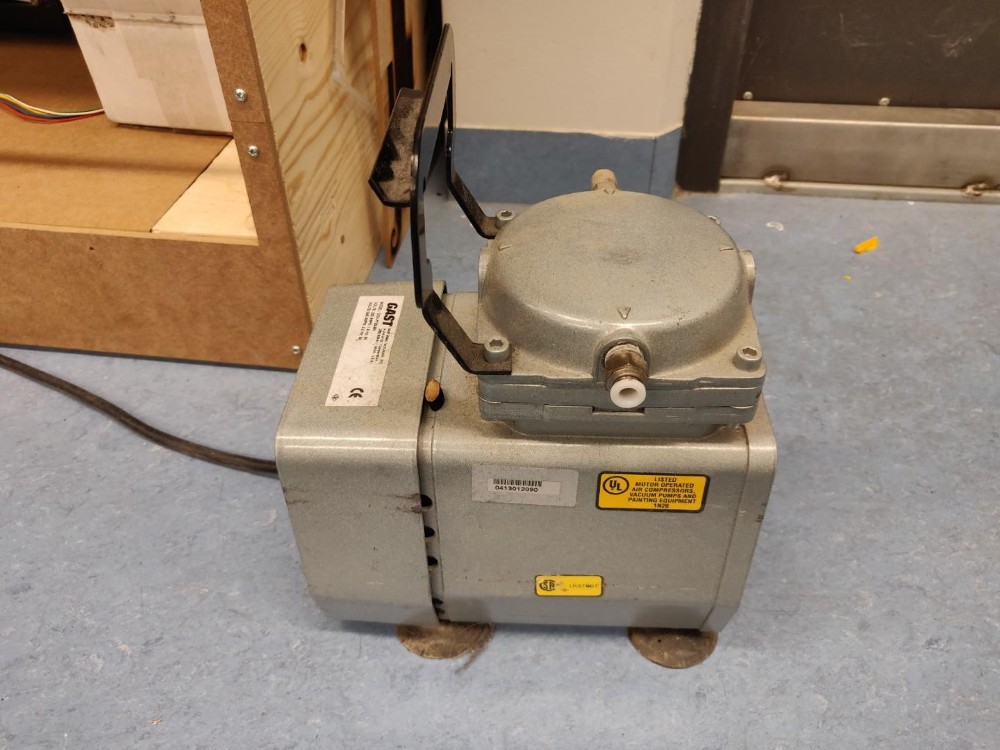
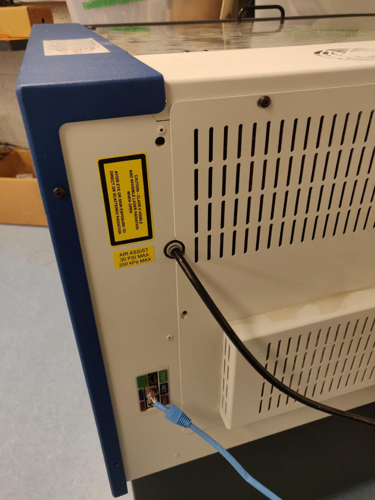
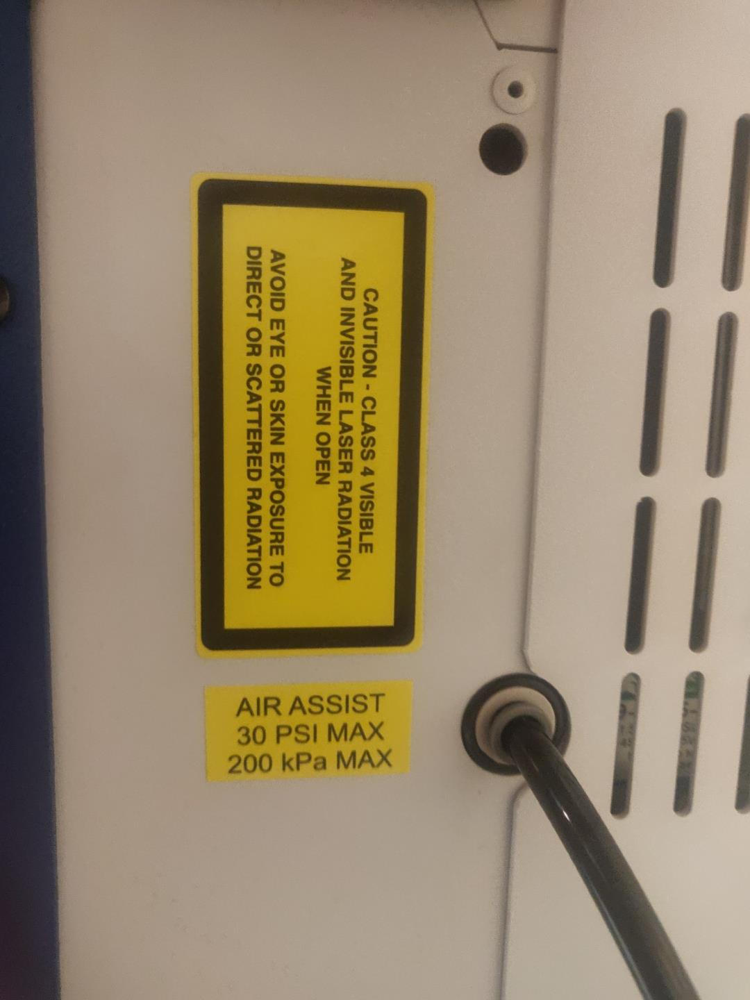
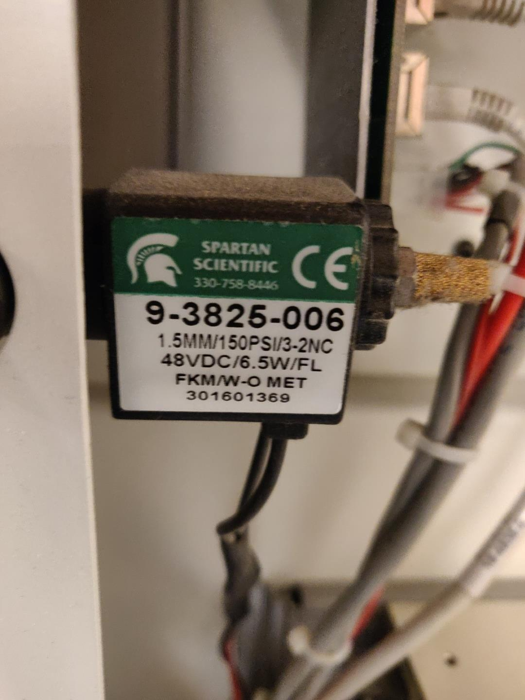
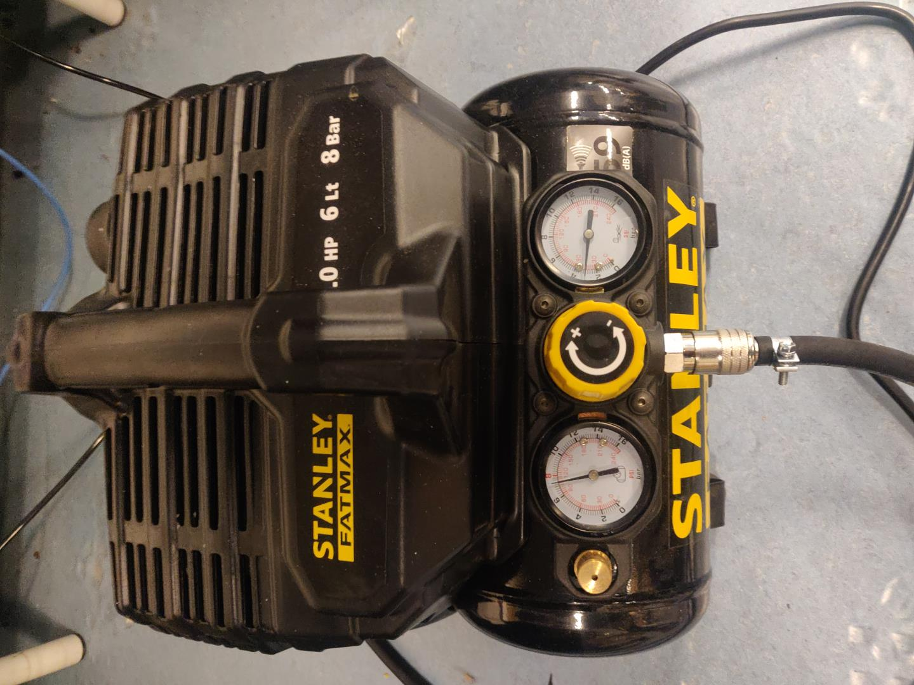
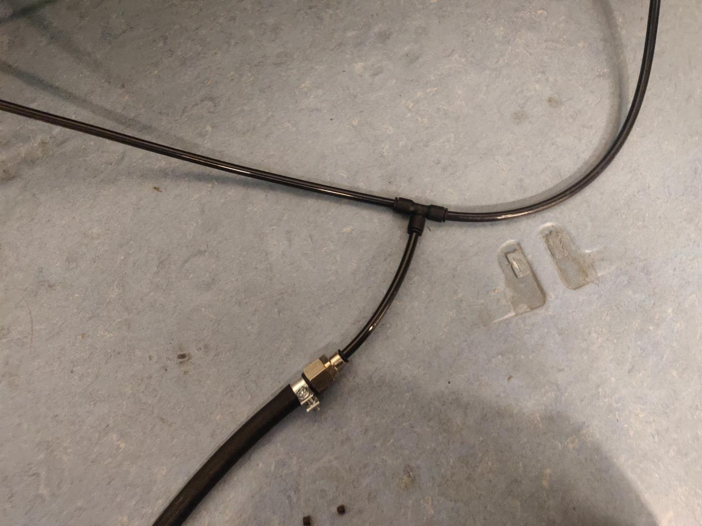

# Epilog-AirAssist
Upgrade the air assist system for Epilog laser cutter, for a better sound environment. 

## Intro

For years staff and students within the Fab Lab here in Akureyri have been slowly going insane. There are multiple reasons for this of course, but one of which is the constant `CHK-CHK-CHK-CHK` sound of the recommended air assist pumps that go with our Epilog laser cutting machines we have. 

## Investigation

Driven to despair, I decided to take a closer look at the air assist system. 

Let's zoom in a little closer: 

Relevant information shown here: `30 PSI MAX`

When I removed the backplate form the cutter, I found this air valve/solenoid: 

## Operation of the valve

The default operation is to let the air escape freely through the outlet when the machine is not cutting. Once the machine starts cutting, the solenoid is engaged and the air passes to the nozzle. 

This means the pump is constantly running, consuming electricity and generating noise. 

## Remedy

- Block the outlet of the air valve
- Replace the pump(s) with a compressor
- Adjust the output pressure of the compressor

### Air valve

To block the outlet, use a 0.19 inch bolt with 10-36 thread. 

Carefully remove the outlet bolt and transfer the rubber gasket to your new bolt. Re-insert the bolt. 

I did not have imperial bolts available, so I [3D printed one](/files/10-36.stl). They hold but I would recommend you get the correct fitting bolt if you can. 

### Compressor

I bought a small, relatively quiet compressor: [Stanley Fatmax Silent Air Compressor](https://www.bigdug.co.uk/workshop-flooring-c348/workshop-c11614/air-compressors-c48481/direct-drive-compressors-c82087/stanley-fatmax-silent-air-compressor-dst101-8-6-6l-8-bar-105l-min-p20637). It's a hobby compressor but seems to be able to satisfy two lasercutters at a time. For a larger setup, you might need a more powerful system. 

The air valve accepts 6mm (outer) diameter air lines. 

Using the appropriate fittings and T-connector, attach your compressors output to your machines. 

Adjust the pressure regulator to output 30PSI and you are all set. 

Enjoy your improved sanity!